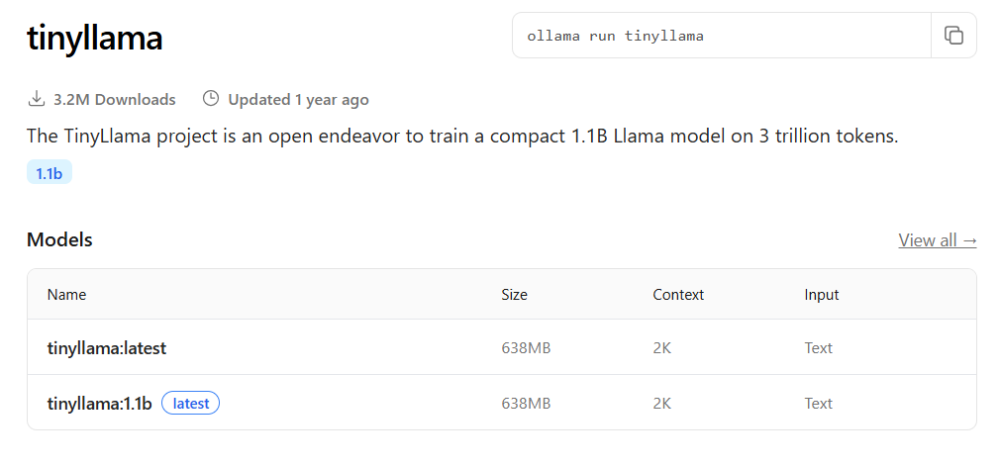

# rag-wiki

## Overview

This is project implements a Retrieval-Augmented-Generation (RAG) Pipeline. Wikipedia is used as information source and user is presented with answers based on it.

## Motivation

The goal of this project is to build a fully local, CPU-only RAG system under strict hardware constraints (8GB RAM, no GPU).
It explores trade-offs in:

- Chunking and overlap tuning
- Embedding and vector store design
- Deduplication strategies
- Local LLM inference with compact models

## Pipeline flow

  

  Figure 1: Pipeline Flow

## How to Run

1. Install dependencies: `pip install -r requirements.txt`
2. Run ingestion and indexing: `python src/rag/ingestion/main.py`
3. Run retrieval and generation: `python src/rag/generation/main.py`

## Project Structure

    rag-wiki
        ├── corpus
        │   ├── david_michelangelo_0.json
        │   ├── david_michelangelo_1.json
        │   ├── david_michelangelo_2.json
        │   ├── david_michelangelo_3.json
        │   ├── david_michelangelo_4.json
        │   ├── david_michelangelo_5.json
        │   ├── david_michelangelo_6.json
        │   └── david_michelangelo_7.json
        ├── image-1.png
        ├── image.png
        ├── project_tree.txt
        ├── README.md
        ├── requirements.txt
        ├── src
        │   └── rag
        │       ├── chunking
        │       ├── config
        │       ├── embedding
        │       ├── generation
        │       ├── ingestion
        │       ├── retrieval
        │       ├── utils
        │       └── vector_store
        └── vector_db
            ├── 42e5d76e-cdf9-4aa3-89a8-41dc53e2d5c8
            │   ├── data_level0.bin
            │   ├── header.bin
            │   ├── index_metadata.pickle
            │   ├── length.bin
            │   └── link_lists.bin
            └── chroma.sqlite3

## Data Ingestion and Indexing

- The system performs runtime ingestion by default, fetching source documents dynamically and processing them in memory.
- The chunking module also supports optional offline document loading from disk, but this path is not used in the default execution flow
- Documents are chunked with overlap to preserve context
- Each chunk is embedded using a sentence transformer
- Embeddings _(using -all-miniLM-L6-v2 model)_ are persisted in a Chroma vector database

## Retrieval (Online)

- User query is embedded using the the embedding model _(all-miniLM-L6-v2)_
- Vector similarity search retrieves top*k *(e.g. top*k=8)* relevant chunks
- Retrieval chunks are assembled and treated as constrained context for further use

## Augmented Generation

- using retrieved context and query created prompt created
- A Local LLM _(tinyllm)_ generates answers restricted only in retrieved content

## Generation Results

  

  Figure 2: Generation result

## Challenges

1. **Dataset creation from scratch**

   - Wikipedia disambiguation errors caused frequent ingestion failures.
   - Pages with high ambiguity are currently skipped, which may reduce dataset coverage.

2. **Chunk overlap tuning**

   - Initial configuration (500 tokens, 50 overlap) led to semantically redundant retrievals.
   - After multiple experiments, overlap size was reduced to 10 to improve retrieval diversity.

3. **Dealing with deduplicate**

   - Overlapping chunks and repeated dataset content caused duplicate results.
   - Implemented hash-based deduplication; MMR is planned as a future improvement.

4. **Hardware constraints** -

   - Considering 8 GB RAM with processor 'i5-1035G1 CPU @ 1.00GHz' and local inferencing was daunting to perform. The Ollama is used for it and it offers wide range of models.

   - Initially, the large model (llama3:latest) was tried, but due to its size and resource demands, it was unusable.

   - The smaller model (gemma3:1b, ~700MB) was compact but produced low-quality answers.

   - TinyLlama, a student model, provided best balance between size, inference stability, and answer quality.

  

  Figure 3: TinyLlama specifications

## Key Design Decisions

- **Local-first architecture**: All components (embedding, vector store, LLM) run locally.
- **CPU-only inference**: Model selection prioritized memory footprint and inference stability.
- **Reduced chunk overlap**: Overlap reduced from 50 → 10 to avoid semantic redundancy in retrieval.
- **Deduplication strategy**: Simple hash-based deduplication to prevent repeated retrieval results.
- **Constrained generation**: The LLM is restricted to retrieved context to minimize hallucination.

## Future Work

- Implement MMR-based retrieval to improve diversity
- Improve handling of Wikipedia disambiguation pages
- Experiment with hybrid search (BM25 + vector)
- Add evaluation metrics for retrieval quality
- Extend ingestion to other document sources (e.g., Confluence, PDFs)
